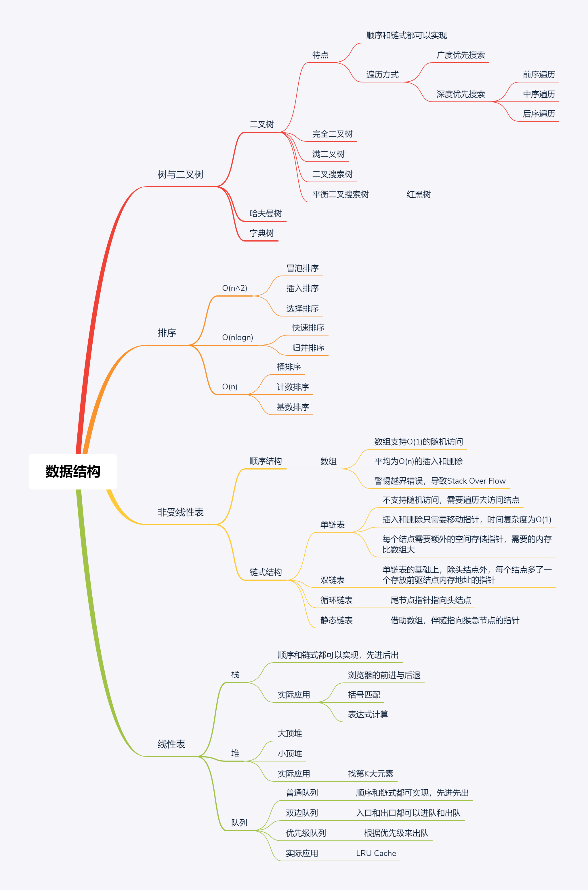
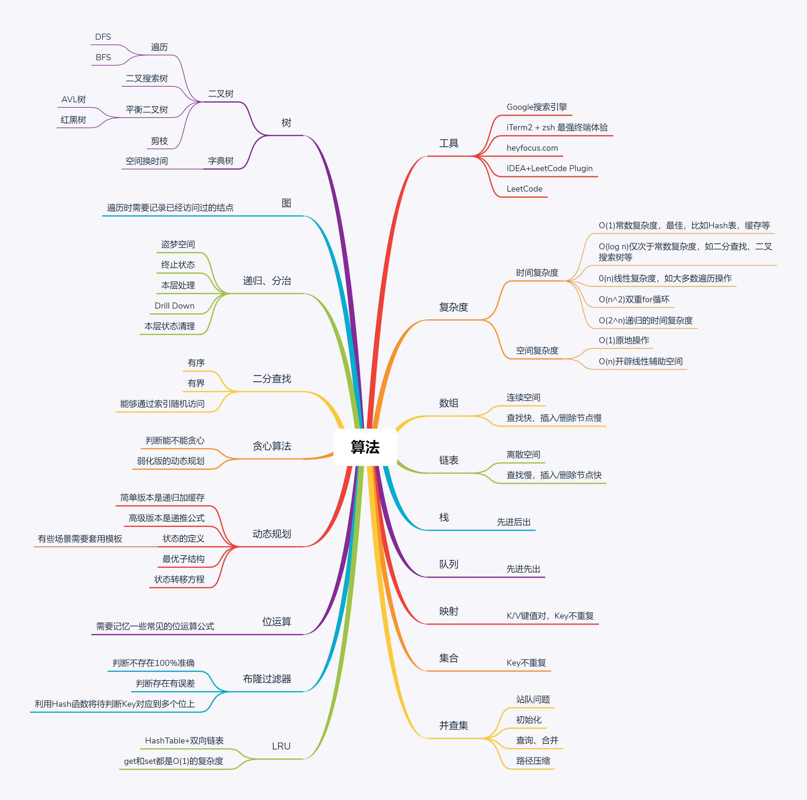

# 算法和数据结构总览
## 如何精通一个领域
1. Chunk it up 切碎知识点
- 庖丁解牛
- 脉络连接
### 数据结构
- 一维
  - 基础：数组array(string),链表linked list
  - 高级：栈stack,队列queue，双端队列deque，集合set，映射map(hash or map),……
- 二维：
  - 基础：树tree，图graph
  - 高级：二叉搜索树binary search tree(red-black tree,AVL),堆heap,并查集disjoint set，字典树Trie，……
- 特殊：
  - 位运算Bitwise，布隆过滤器BloomFiter
  - LRU Cache
注意：了解每个数据结构的原理和代码框架
数据结构脑图

### 算法
- if-else，switch——>branch(分支)
- for,while loop——>iteration(循环，迭代)
- 递归Recursion(Divide & Conquer,Backtrace)
- 搜索Search:深度优先搜索Depth first search(DFS)，广度优先搜索Breadth first search(BFS),A*,……
- 动态规划Dynamic Programming
- 二分查找Binary Search
- 贪心Greedy
- 数学Math，几何Geometry
注意：在头脑中会议上面每种算法的思想和代码模板
算法脑图

1. Deliberate Practicing刻意练习
### 职业化运动
- 基本功是区别业余和职业选手的根本
- 基础动作的分解训练和反复练习->最关键的点
  - 乒乓球
  - 台球
  - 滑雪
### 练习的方法
- 刻意练习——过遍数
- 练习缺点、弱点地方
- 不舒服、不爽、枯燥
- 生活中例子：乒乓球、台球、游戏等等
2. Feedback 反馈
### Feedback
- 即时反馈
- 主动型反馈(自己去寻找)
  - 看高手写代码(GitHub，LeetCode，……)
  - 第一视角直播
- 被动式反馈(高手给你指点) 
  - code review
  - 教练看你打，给你反馈
### 切题四件套
- Clarification(说明问题的解法)
- Possible solutions(找到可以解决的方法)
  - compare(time/space)(比较时间复杂度和空间复杂度)
  - optimal(加强)(找到最佳的解法)
- Coding(多写)
- Test cases(举出测试用例)

## 五步刷题法
### 刷题第一遍
- 5分钟：读题+思考
- 直接看解法：注意！多解法，比较解法优劣
- 背诵，默写好的解法
### 刷题第二遍
- 马上自己写——>LeetCode提交
- 多种解法比较、体会->优化
### 刷题第三遍
- 过了一天后，再重复做题
- 不同解法的熟练程度——>专项练习
### 刷题第四遍
- 过了一周，反复回来练习相同题目
### 刷题第五遍
- 面试前一周恢复性训练

