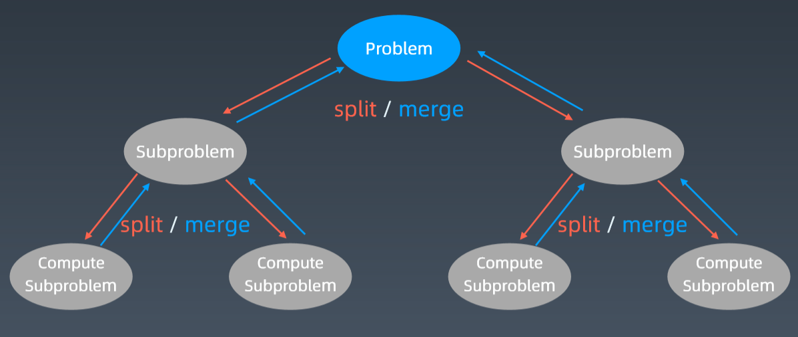
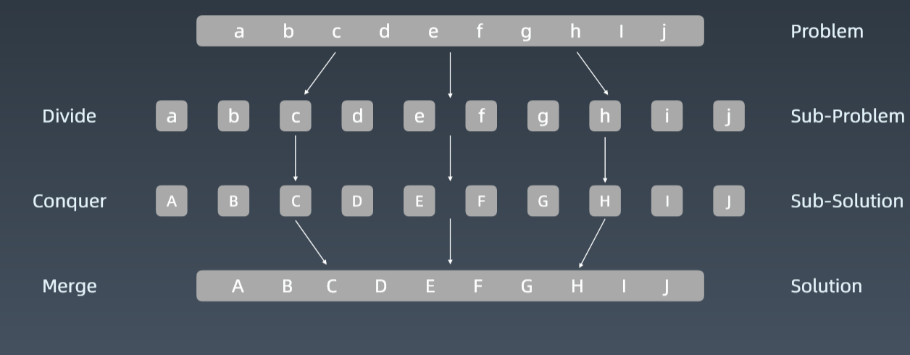
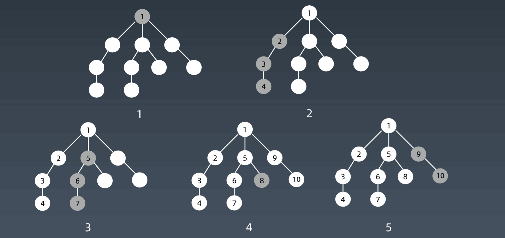
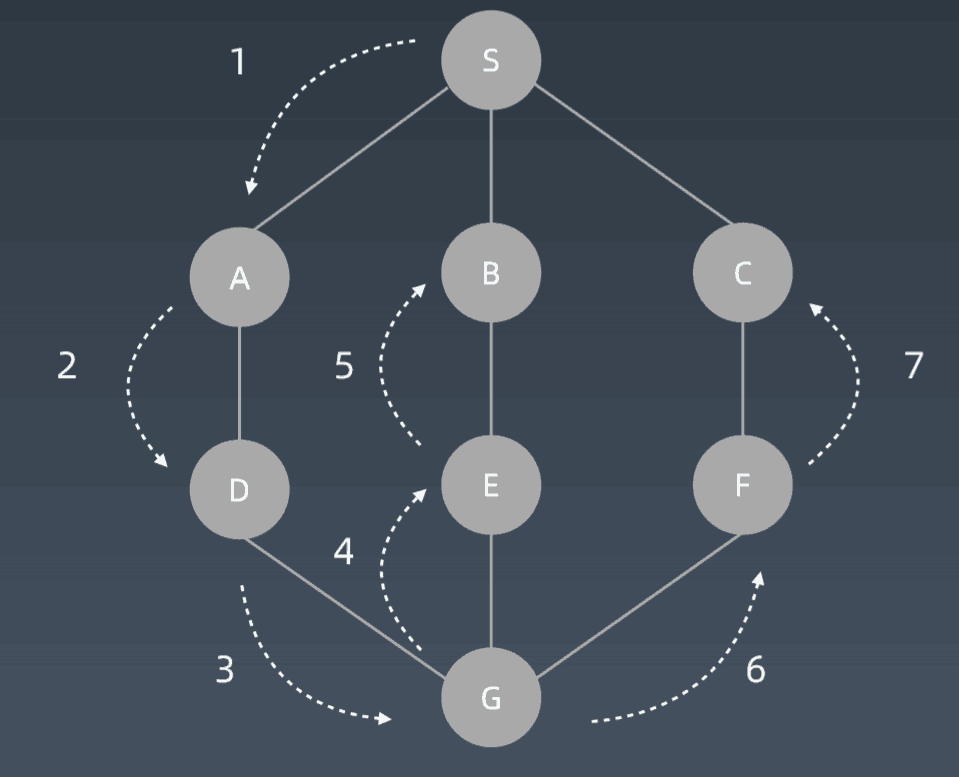
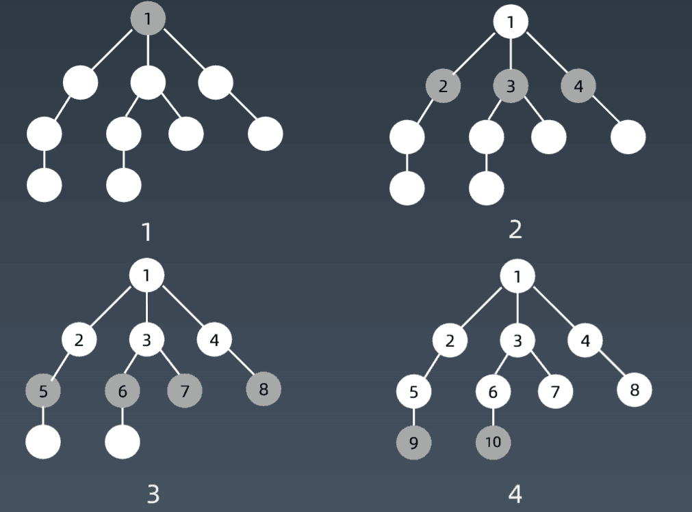
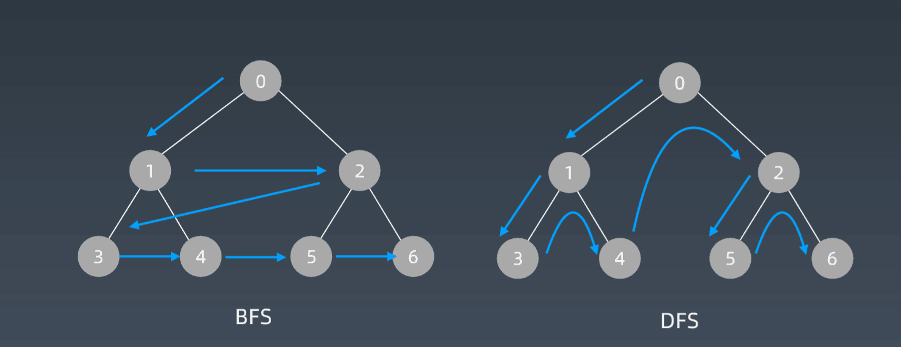

# 分治、回溯
## 分治Divide&Conquer
### 递归状态树



### 分治代码模板
```python
def divide_conquer(problem,param1,param2,……):
# resursion terminator
if problem is None:
    print_result
    return 
# prepare data
data = prepare_data(problem)
subproblems=split_problem(problem,data)

# conquer subproblems
subresult1 = self.divide_conquer(subpromblems[0],p1,……)
subresult2 = self.divide_conquer(subpromblems[1],p1,……)
subresult3 = self.divide_conquer(subpromblems[2],p1,……)
……
# process and generate the final result
result = process_result(subresult1,subresult2,subresult3,……)
```
## 回溯Backtracking
回溯法采用试错的思想，它尝试分布的去解决一个问题。在分步解决问题的过程中，当它通过尝试发现现有的分步答案不能得到有效的正确的解答的时候，它将取消上一步甚至是上几步的计算，再通过其他的可能的分步解答再次尝试寻找问题的答案。

回溯法通常用最简单的递归方法来实现，在反复重试上述的步骤后可能出现两种情况:
- 找到一个可能存在的正确的答案;
- 在尝试了所有可能的分步方法后宣告该问题没有答案。
在最坏的情况下，回溯法会导致一次复杂度为指数时间的计算。

# 深度优先搜索和广度优先搜索
## 遍历搜索
在树(图/状态集)中寻找特定结点
```C++
struct TreeNode{
    int val;
    TreeNode *left;
    TreeNode *right;
    TreeNode(int x): val(x),letf(NULL),right(NULL){}
}
```
## 搜索-遍历
- 每个节点都要访问一次
- 每个结点仅仅要访问一次
- 对于结点的访问顺序不限
    - 深度优先: depth first search
    - 广度优先：breadth frist search
```python
def dfs(node):
    if node in visited:
    # already visited
        return 
    visited.add(node)
    # process current node
    #...#logic here
    dfs(node.left)
    dfs(node.right)
```
# 深度优先搜索 Depth-First-Search
## DFS代码-递归写法
```python
visited=set()
def dfs(node,visited):
    if node in visited:# terminator
    #already visited
    return

    visited.add(node)
    #process current node here.
    ...
    for next_node in node.children():
        if not next_node in visited:
            dfs(next node,visited)
```
## 遍历顺序



## DFS代码-非递归写法
```python
def DFS(self,tree):
    if tree.root is None:
        return []
    visited,stack = [],[tree.root]
    while stack:
        node = stack.pop()
        visited.add(node)
        process(node)
        nodes = generate_related_nodes(node)
        stack.push(nodes)
# other processing work
...
```
# 广度优先搜索 Breadth-First-Search
## 遍历顺序


### BFS代码
```python
def BFS(graph,start,end):
    queue=[]
    queue.append([start])
    visited.add(start)
    while queue:
        node = queue.pop()
        visited.add(node)

        process(node)
        nodes=generate_related_nodes(node)
        queue.push(node)
# other processing work
visited = set()
def dfs(node,visited):
    visited.add(node)
    # process current node here.
    ...
    for next_node in node.children():
        if not next_node in visited:
            dfs(next node,visited)
def BFS(graphs,start,end):
    queue=[]
    queue.append([start])
    visited.add(start)

    while queue:
        node = queue.pop()
        visited.add(node)

        process(node)
        nodes=generate_related_nodes(node)
        queue.push(nodes)

```