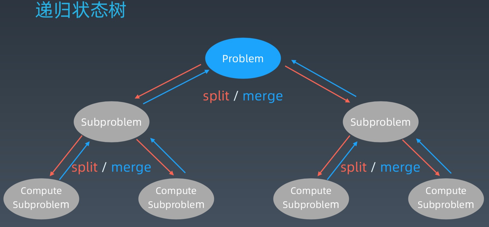
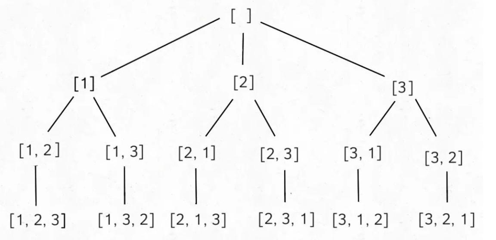
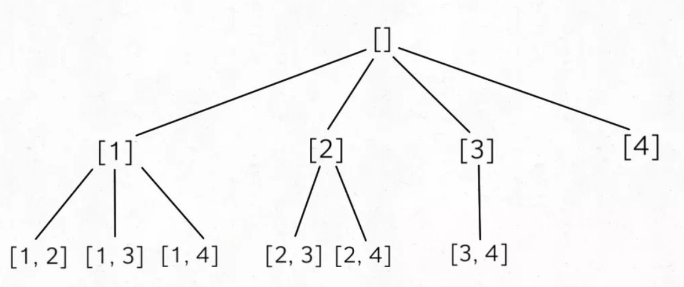

# Week03-lession8 分治、回溯

分治： 找重复问题，将大问题或复杂的问题分解成单一的子问题，且子问题之间没有关联性；然后使用递归思想计算每个子问题，最后再合并每个子问题的结果。



### 分治代码模板
```python
def divide_conquer(problem, param1, param2, ...): 
  # recursion terminator 
  if problem is None: 
	print_result 
	return 

  # prepare data 
  data = prepare_data(problem) 
  subproblems = split_problem(problem, data) 

  # conquer subproblems 
  subresult1 = self.divide_conquer(subproblems[0], p1, ...) 
  subresult2 = self.divide_conquer(subproblems[1], p1, ...) 
  subresult3 = self.divide_conquer(subproblems[2], p1, ...) 
  …

  # process and generate the final result 
  result = process_result(subresult1, subresult2, subresult3, …)
	
  # revert the current level states
```

#### 分治算法应用

- 50.Pow(x, n)  (50_powx_n.py)


### 回溯

回溯法采用试错的思想，它尝试分步的去解决一个问题。在分步解决问题的过程中，
当它通过尝试发现现有的分步答案不能得到有效的正确的解答的时候，它将取消上
一步甚至是上几步的计算，再通过其它的可能的分步解答再次尝试寻找问题的答案。

回溯法通常用最简单的递归方法来实现，在反复重复上述的步骤后可能出现两种情况:
• 找到一个可能存在的正确的答案;
• 在尝试了所有可能的分步方法后宣告该问题没有答案。 在最坏的情况下，回溯法会导致一次复杂度为指数时间的计算。


回溯法是一种探索所有潜在可能性找到解决方案的算法。如果当前方案不是正确的解决方案，或者不是最后一个正确的解决方案，则回溯法通过修改上一步的值继续寻找解决方案

#### 回溯算法模板
``` json
result = []
def backtrack(路径, 选择列表):
  if 满足结束条件:
      result.add(路径)
      return
  for 选择 in 选择列表:
      做选择
      backtrack(路径, 选择列表)
      撤销选择
```

#### 回溯算法应用

- 22.括号生成问题（22_generate_parentheses.py）
- 51.N皇后

- 排列问题

输入一个不包含重复数字的数组 nums，返回这些数字的全部排列


``` json
List<List<Integer>> res = new LinkedList<>();

/* 主函数，输入一组不重复的数字，返回它们的全排列 */
List<List<Integer>> permute(int[] nums) {
    // 记录「路径」
    LinkedList<Integer> track = new LinkedList<>();
    backtrack(nums, track);
    return res;
}

void backtrack(int[] nums, LinkedList<Integer> track) {
    // 触发结束条件
    if (track.size() == nums.length) {
        res.add(new LinkedList(track));
        return;
    }

    for (int i = 0; i < nums.length; i++) {
        // 排除不合法的选择
        if (track.contains(nums[i]))
            continue;
        // 做选择
        track.add(nums[i]);
        // 进入下一层决策树
        backtrack(nums, track);
        // 取消选择
        track.removeLast();
    }
}
```

- 组合问题

输入两个数字 n, k，算法输出 [1..n] 中 k 个数字的所有组合.
使用回溯算法，k 限制了树的高度，n 限制了树的宽度，比如输入 n = 4, k = 2，输出如下结果，顺序无所谓，但是不能包含重复（按照组合的定义，[1,2] 和 [2,1] 也算重复）：
[ [1,2], [1,3],[1,4],[2,3],[2,4],[3,4] ]



```json

List<List<Integer>> res = new LinkedList<>()
List<List<Integer>> combine(int n, int k) {
    if (k <= 0 || n <= 0) return res;
    List<Integer> track;
    backtrack(n, k, 1, track);
    return res;
}

void backtrack(int n, int k, int start, List<Integer>& track) {
    // 到达树的底部
    if (k == track.size()) {
        res.push_back(track);
        return;
    }
    // 注意 i 从 start 开始递增
    for (int i = start; i <= n; i++) {
        // 做选择
        track.push_back(i);
        backtrack(n, k, i + 1, track);
        // 撤销选择
        track.pop_back();
    }
}

```