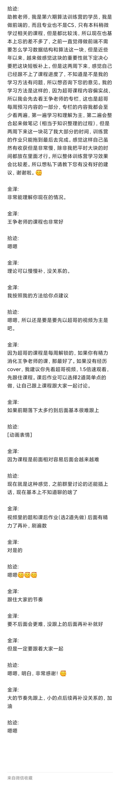

# 学习笔记

## 体会
> 本周体会满深的，起源在于前俩周的学习自己“主意”有点太大了，导致整体下来课程的效果并不是很好。好在周一的时候我勇敢的向助教老师咨询，并且明白了当前存在的问题和正确的学习方法（聊天内容见附件，仅分享给训练营的同学们，如果你和我有一样的疑惑希望能有所参考。如果对外请脱敏处理，谢谢啦）。而且经过一周的践行，发现收获的确不少，继续加油，W4 把之前落下的补上，争取其中考个好成绩。谢谢助教老师！！！

## 感悟
这周思考的会多一点，直接说几个点吧：
1. 学习方法
一定要按照超哥在训练营开营的时候提到的学习方法去学习，因为训练营和以往的学习方式不同，按照超哥的思路，才能获得训练营最大价值。另外，也希望在以后的训练营中能强调下训练营的特殊性（时间短、内容多、有一套完整的体系，所以一定要按照官方的思路和方法去跟，否则很容易掉队）和学习方法（预习+视频+课后该如何做，应该做到什么程度，现在来看训练营对我来说强度还蛮大的，提前说明这一点可能会在开营前准备的更好一点）这一块，否则像我这种想法多的同学很容易走弯路。

2. 栈、队列
在学习栈和队列的时候，可能就是认为这仅仅只是一种数据结构而已，而且超级简单。但是通过学习递归和这周的搜索、贪心，会发现栈和队列也是一种解决问题的思路，或者称之为“编码思路”。在递归转迭代循环的时候，经常脑子里会想不清楚，但是如果知道栈其实模拟的是递归，而队列会帮助保存“执行顺序”对于理解起来会简单很多。这对于超哥最开始说的数据结构和算法在其他很多方面都有所体现，更多是思维上的训练，体会的更深了。

3. 代码模板
if else for loop + recursion 基础上再加上一些套路（代码模板），再加上五毒神掌和四步切题法，感觉“妈妈再也不用担心我的数据结构与算法了”。

## 笔记
笔记就不贴出来了，更多的是视频课程的一些简单的笔记，我自己存着就好。

## 不足
这周还是没能够按照计划完成目标，趁着下周期中一定赶上进度，加油！

---
附件：
