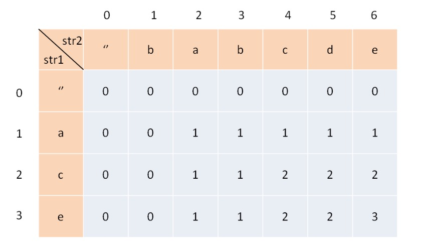

### 递归代码模板
```java
public void recur(int level, int param){
    //terminator
    if(level>MAX_LEVEL){
        //process result
        return;
    }
    // process current login
    process(level, param);

    //drill down
    recur(level:level+1, newParam);

    //restore current status
}
```

### 分治代码模板
```python
def divide_conquer(problem, param1, param2, ...):
    # recursion terminator
    if problem is None:
        print_result
        return
    
    # prepare data
    data = prepare_data(problem)
    subproblems = split_problem(problem, data)

    # conquer subproblems
    subresul1 = self.divide_conquer(subproblems[0], p1, ...)
    subresul2 = self.divide_conquer(subproblems[1], p1, ...)
    subresul3 = self.divide_conquer(subproblems[2], p1, ...)
    ...

    # process and generate the final result
    result = process_result(subresult1, subresul2, subresul3, ...)

    # revert the current level states
```

### 动态规划Dynamic Programming

动态规划和递归或者分治没有根本上的区别（关键看有无最优的子结构）

共性：找到重复子问题

差异性：最优子结构、中途可以淘汰次优解

关键点：
```json
1. 最优子结构 opt[n] = best_of(opt[n-1], opt[n-2], ...)
2. 储存中间状态:opt[i]
3. 递推公式(美其名曰:状态转移方程或者 DP 方程)
Fib: opt[i] = opt[n-1] + opt[n-2]
二维路径:opt[i,j] = opt[i+1][j] + opt[i][j+1] (且判断a[i,j]是否空地)
```

the five easy steps to DP:
```json
1. 定义子问题(define subproblems)
2. 推算子问题的递推方程(guess - part of solution)
3. 合并子问题的解(relate subproblem solutions)
4. 递归且存储中间结果(recurse & memorize or build DP table bottom-up)
5. 解决整个问题(solve original proble)
```


### Fib(n) 记忆式
```c
int Fib(int n, int[] mem){
    mem[0] = 0
    mem[1] = 1
    for(int i=2; i<=2; i++){
        if(mem[i] == 0){
            mem[i] = mem[i-1]+mem[i-2]
        }
    }
    return mem[n]
}

时间复杂度: O(n)
普通的Fib(n)时间复杂度: O(2^n)
```

### 计算路径
使用DP算法，求解路径问题
```java
// 63题：投票最多的一个方案
public int uniquePathsWithObstacles(int[][] obstacleGrid) {
    int width = obstacleGrid[0].length;
    int[] dp = new int[width];
    dp[0] = 1;
    for (int[] row : obstacleGrid) {
        for (int j = 0; j < width; j++) {
            if (row[j] == 1)
                dp[j] = 0;
            else if (j > 0)
                dp[j] += dp[j - 1];
        }
    }
    return dp[width - 1];
}

```

### 1143：最大公约子序列LCS
Build to DP table bottom-up:

