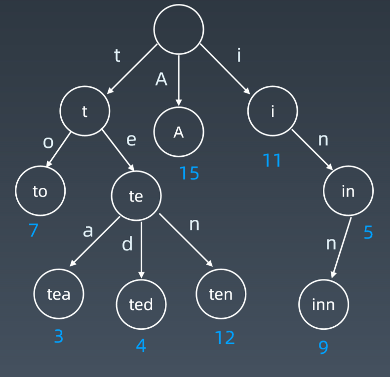
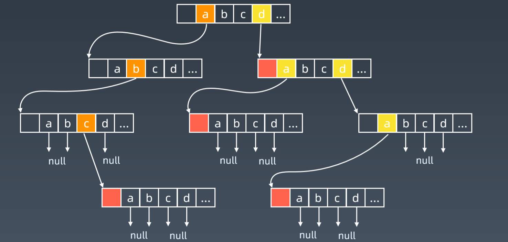

# 字典树和并查集
## 学习大纲
1. 字典树的数据结构
2. 字典树的核心思想
3. 字典树的基本性质

## 基本结构
字典树，即Trie树，又称胆子查找树或键树，是一种树形结构。典型应用是用于统计和排序大量的字符串(但不限于字符串),所以经常被搜索引擎系统用于文本词频率统计。

它的优点是：最大限度地减少无谓的字符串比较，查询效率比哈希表高。

## 基本性质
1. 结点本身不存完整单词；
2. 从根节点到某一结点，路径上经过的字符连接起来，为该结点对应的字符串；
3. 每个结点的所有子节点路径代表的字符串都不相同。

## 结点存储额外信息


## 结点的内部实现



## 实战例题
[实现Trie（前缀树）](https://leetcode-cn.com/problems/implement-trie-prefix-tree/#/description)

```py
class Trie(object):
    def __init__(self):
        self .root = {}
        self .end_of_word = "#"   
    def insert(self, word):
        node = self.root
        for char in word:     
            node = node.setdefault(char, {})
        node[self .end_of_word] = self.end_of_word
   def search(self, word):
       node = self.root
       for char in word:
            if char not in node:
                return False
            node = node[char]
        return self.end_of_word in node   
        
    def startsWith(self, prefix):
        node = self.root
            for char in prefix:
                if char not in node:
                    return False
                 node = node[char]
            return True

```

[单词搜索II](https://leetcode-cn.com/problems/word-search-ii/)
```cpp
struct Node {
    bool word;
    string str;
    unordered_map<char, Node*> words;
};
class Trie {
public:
    Trie() {
        root = new Node();
    }
    void insert(string word) {
        Node* p = root;
        for (char c: word) {
            if (p->words.find(c) == p->words.end()) {
                Node* t = new Node();
                p->words[c] = t;
            } 
            p = p->words[c];
        }
        p->str = word; // node对应的word，为了之后根据node来找到结果
        p->word = true;
    }
    void search(vector<string>& res, vector<vector<char>>& board) {
        for (int i = 0; i < board.size(); i++) {
            for (int j = 0; j < board[i].size(); j++) {
                help(res, board, root, i, j);
            }
        }
    }
    void help(vector<string>&res, vector<vector<char>>& board, Node* p, int x, int y) {
        if (p->word) {
            p->word = false; // 其他方向就不会再把答案放进去了
            res.push_back(p->str);
            return;
        } 
        if (x < 0 || x == board.size() || y < 0 || y == board[x].size()) return;
        if (p->words.find(board[x][y]) == p->words.end()) return;
        p = p->words[board[x][y]]; // 此时的p是其他字符了
        char cur = board[x][y];
        board[x][y] = '#';
        help(res, board, p, x+1, y);
        help(res, board, p, x-1, y);
        help(res, board, p, x, y+1);
        help(res, board, p, x, y-1);
        board[x][y] = cur;
    }
    
private:
    Node* root;
};
class Solution {
public:
    vector<string> findWords(vector<vector<char>>& board, vector<string>& words) {
        Trie trie;
        vector<string> res;
        for (string& w: words) {
            trie.insert(w);
        }
        trie.search(res, board);
        return res;
        
    }
};
```
