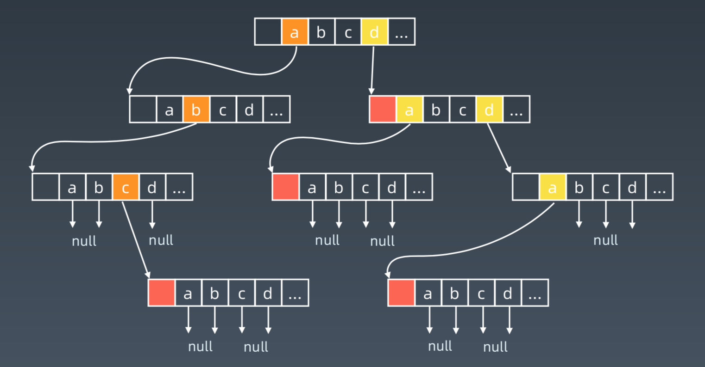

## 字典树 （Trie树）

### Trie树 或 前缀树
Trie (发音为 "try") 或前缀树是一种树数据结构，用于检索字符串数据集中的键。
应用在自动补全、拼写检查、IP 路由 (最长前缀匹配)、T9 (九宫格) 打字预测 和 单词游戏。

前缀树与哈希表和平衡树相比有点：
- 找到具有同一前缀的全部键值
- 按词典序枚举字符串的数据集
- 与哈希表相比，Trie 树在存储多个具有相同前缀的键时可以使用较少的空间
- 时间复杂度为O(m), 其中m是键长；
- 查询效率比哈希表高，随着哈希表大小增加，会出现大量的冲突，时间复杂度可能增加到 O(n)，其中 n 是插入的键的数量；在平衡树中查找键值需要 O(mlogn) 时间复杂度；

### Trie 树的结点结构

Trie 树是一个有根的树，其结点具有以下字段：
- 最多 R 个指向子结点的链接，其中每个链接对应字母表数据集中的一个字母(假定 R 为 26，小写拉丁字母的数量)
- 每个Node包含一个布尔字段，以指定节点是对应键的结尾还是键前缀



### TrieNode

```java
public class TrieNode{
    private TrieNode[] links;
    private final int R = 16;
    private boolean isEnd;

    public TrieNode(){
        links = new TrieNode[R];
    }

    public boolean containsKey(char ch){
        return links[ch - 'a'] != null ;
    }

    public TrieNode get(char ch){
        return links[ch - 'a'];
    }

    public void put(char ch , TrieNode node){
        links[ch - 'a'] = node;
    }
    public void setEnd(){
        isEnd = true;
    }
    public boolean isEnd(){
        return isEnd;
    }

}
```

### python 版本Trie树
```python
class Trie(object):
    def __init__(self):
        self.root = {}
        self.end_of_word = '#'
    
    def insert(self, word):
        node = self.root
        for ch in word:
            node = node.setdefault(ch, {})
        node[self.end_of_word] = self.end_of_word
    
    def search(self, word):
        node = self.root
        for ch in word:
            if ch not in node:
                return False
            node = node[ch]
        return self.end_of_word in node
    
    def startsWith(self, prefix):
        node = self.root
        for ch in word:
            if ch not in prefix:
                return False
            node = node[ch]
        return True
```

### 并查集
每个元素可以看做一个孤立的集合，只有自身；
然后，再将相邻满足条件的集合合并；
最后，计算剩余孤立集合个数。

并查集模板
```python
class DisjointSet(object):
    def __init__(self, p):
        p = [i for i in range(n)]

    def union(self, p, i, j):
        p1 = self.parent(p, i)
        p2 = self.parent(p, j)
        if p1 != p2:
            p[p1] = p2

    def parent(self, p, i):
        root = i
        while p[root] != root:
            root = p[root]
        while p[i] != i:
            x = i
            i = p[i]
            p[x] = root
        
        return root
```

